# 🚀 Mars IT School – Landing Page

Bu loyiha **Mars IT School** uchun ishlab chiqilgan zamonaviy va interaktiv **landing page** hisoblanadi.  
Loyiha **React + TypeScript** asosida yozilgan bo‘lib, kuchli animatsiyalar, 3D vizual effektlar va Telegram bot bilan integratsiyani o‘z ichiga oladi.

---

## 🛠 Texnologiyalar

- ⚛️ React
- 🟦 TypeScript
- 🎨 Tailwind CSS
- 🎞 Framer Motion
- ✍️ Typewriter Effect
- 🌌 Three.js
- 🤖 Telegram Bot API

---

## Screenshots

### First Section
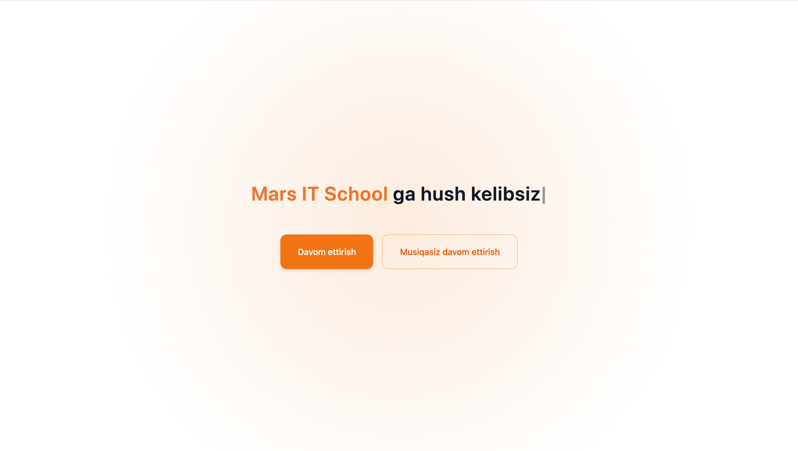

### Home Section
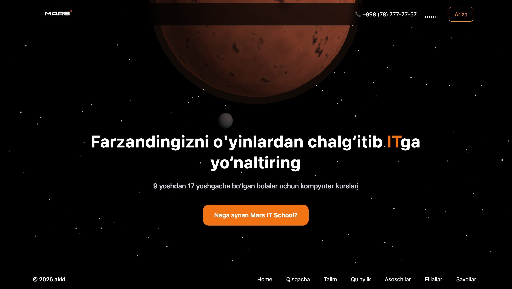

### Ariza Section
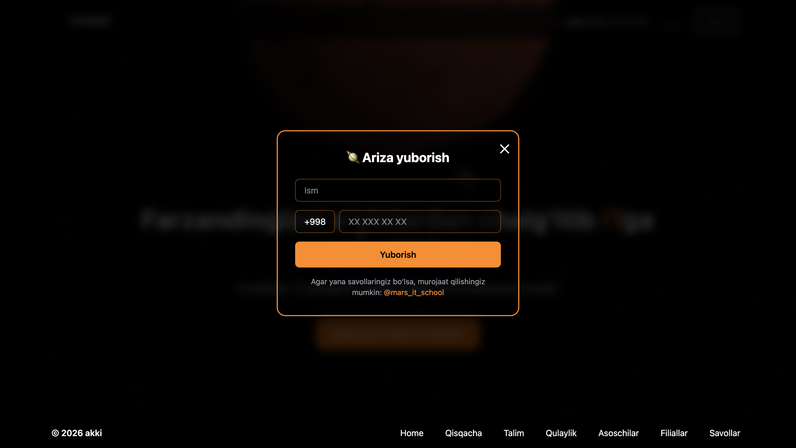

### Batafsil Section
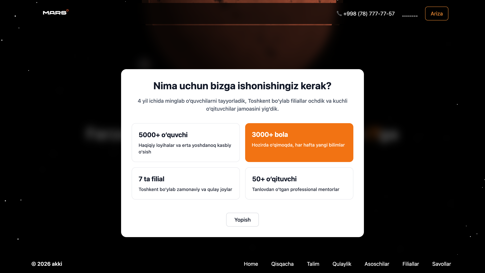

### Qisqacha Section
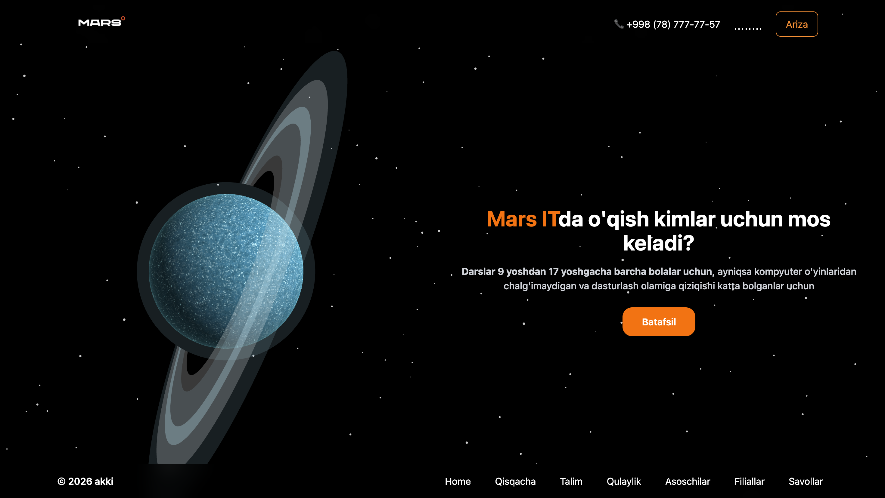

### Talim Section
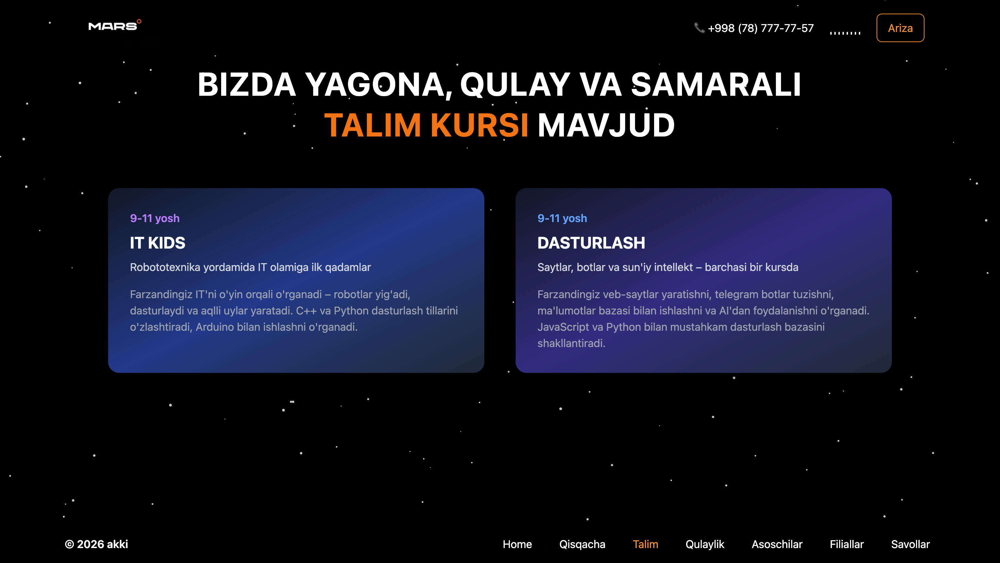

### Qulaylik Section
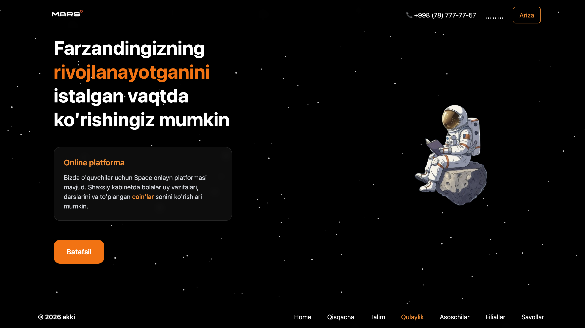

### Asoschilar Section
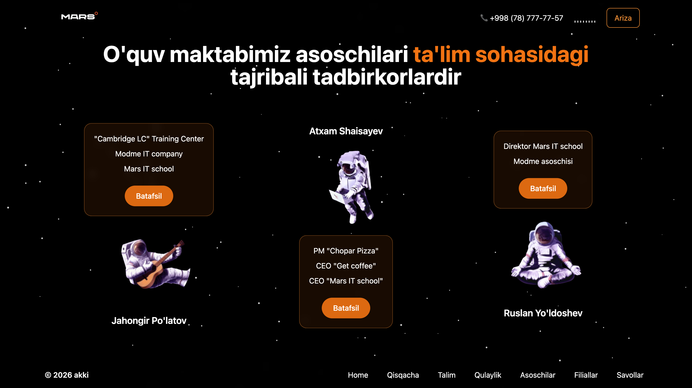

### Filiallar Section
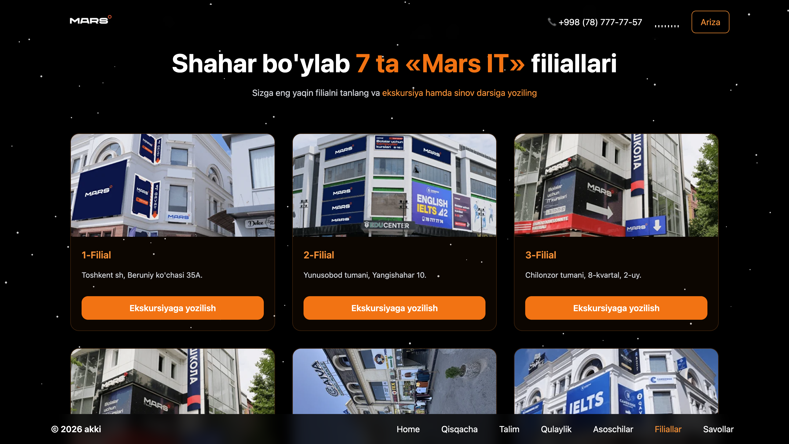

### Savollar Section
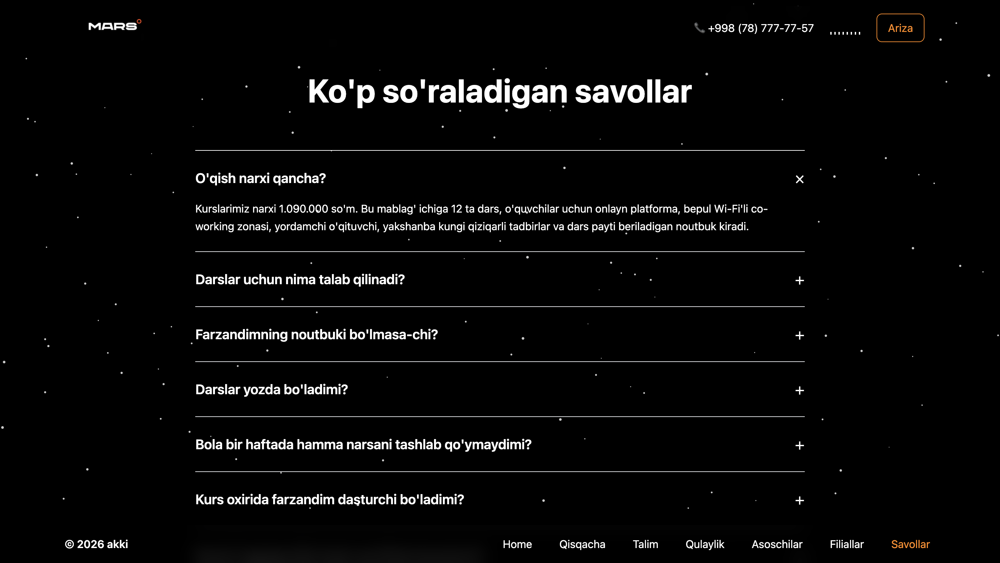

### Taklif Section
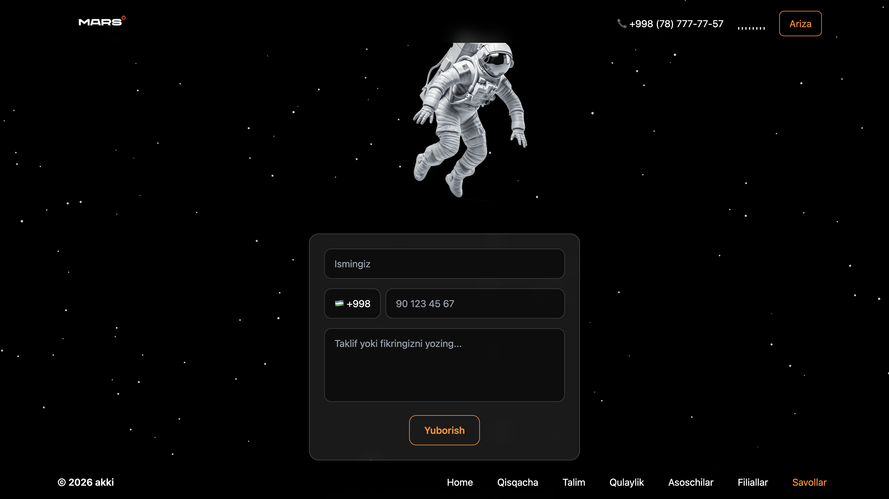

---

## 📁 Project Structure

```text
src/
├── assets/
├── components/
├── App.tsx
├── main.tsx
└── index.css

⸻

⚙️ O‘rnatish

git clone https://github.com/akmalqodirov005/mars-itschool.git
cd mars-itschool
npm install


⸻

▶️ Ishga tushirish

npm run dev

Brauzerda:

http://localhost:5173


⸻

🧩 Asosiy imkoniyatlar (Features)
	•	✅ To‘liq responsive dizayn (mobile / tablet / desktop)
	•	✅ TypeScript bilan type-safe kod
	•	✅ Framer Motion orqali silliq animatsiyalar
	•	✅ Three.js bilan 3D effektlar
	•	✅ Typewriter effect bilan interaktiv matnlar
	•	✅ Telegram bot orqali arizalarni avtomatik yuborish
	•	✅ Toza va scalable arxitektura

⸻

👤 Muallif

Akmal Qodirov
Frontend Developer (React / TypeScript)
	•	GitHub: https://github.com/akmalqodirov005
	•	Telegram: @akmaldev_1